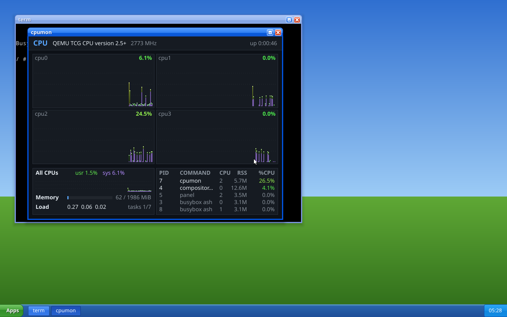
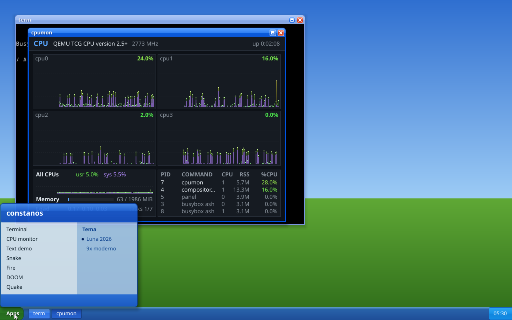
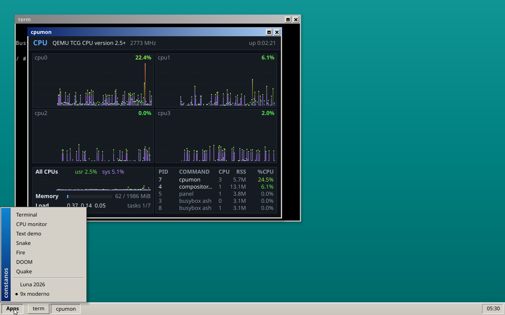
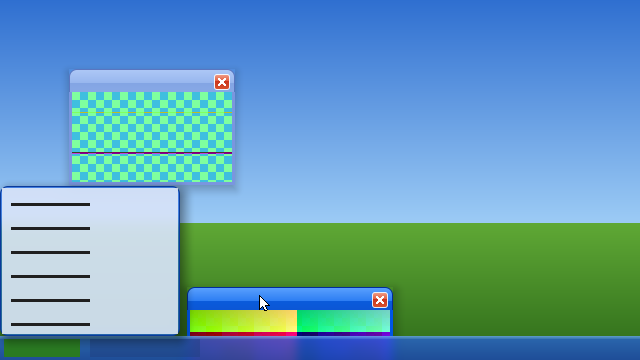
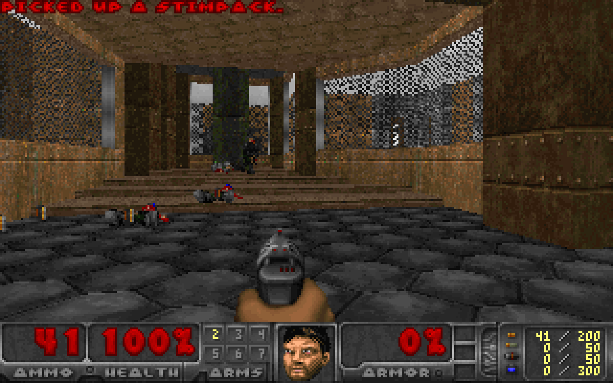
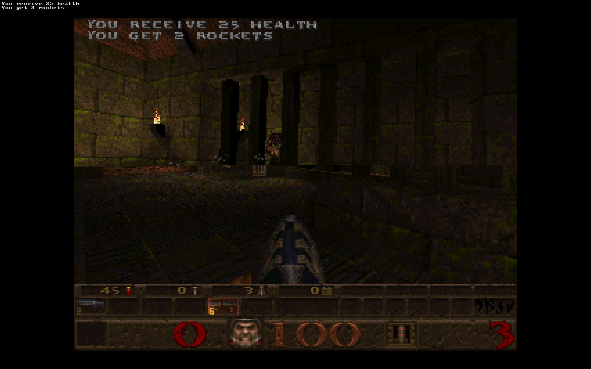
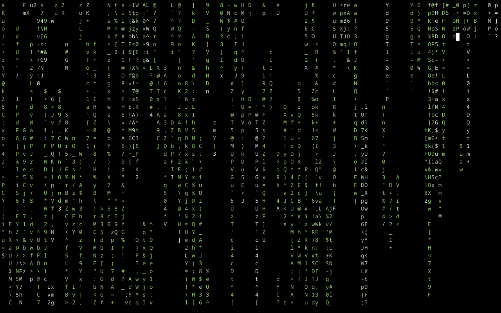

# 🦀 constanos — un sistema operativo x86-64 en Rust

*[English](README.md) · Español*

Un kernel escrito desde cero en Rust (`no_std`, UEFI, SMP) con ABI de syscalls
numerada como Linux, [mlibc](https://github.com/managarm/mlibc) como libc,
BusyBox como userland, un escritorio con compositor propio y un driver para una
NVIDIA RTX 3050 (GA106) que llega hasta Vulkan con el NVK de Mesa. Corre en QEMU
y en una máquina física (AM4 / Ryzen 9 5900X), donde no hay puerto serie y todo
—teclado, mouse, disco— entra por USB.



*El escritorio con el tema **Luna 2026**: `term` (BusyBox `ash`) y `cpumon` en
ventanas, barra de tareas con los botones de las ventanas abiertas y el reloj.
Captura real de QEMU con 4 CPUs.*

<table>
<tr>
<td></td>
<td></td>
</tr>
<tr>
<td><em>Menú de inicio (Luna): las aplicaciones de <code>/mnt/etc/gui/apps</code> y el selector de tema.</em></td>
<td><em>El mismo escritorio en <strong>9x moderno</strong>, cambiado desde el menú (o con F12).</em></td>
</tr>
</table>



*Vidrio en el compositor por GPU (`vk_comp`): la barra y el menú copian lo que
tienen detrás, lo desenfocan con un blur gaussiano en compute shader y se dibujan
encima. Es un frame del arnés `probes/nvk/host-comp.sh`, que corre el renderizador
real sobre lavapipe y lo compara píxel a píxel con la rasterización por CPU.*

<table>
<tr>
<td></td>
<td></td>
<td></td>
</tr>
<tr>
<td><em>DOOM, con mouse y sonido.</em></td>
<td><em>Quake, partida real con QuakeC.</em></td>
<td><em><code>cmatrix</code> sobre un port propio de ncurses.</em></td>
</tr>
</table>

## 🚀 Qué tiene

### Núcleo

- **Boot UEFI** (crate `bootloader`), framebuffer GOP, log del kernel en serie, en
  `/proc/dmesg` y —en la máquina real— en una partición del pendrive.
- **SMP**: hasta 32 CPUs (APs por trampolín, LAPIC timer one-shot, I/O APIC, MSI/MSI-X),
  un scheduler preemptivo de prioridades multinivel compartido por todas las CPUs (los
  procesos migran entre ellas), TLB shootdown entre CPUs. Las reglas de
  locks e interrupciones que lo hacen andar están en `CLAUDE.md`.
- **Memoria**: buddy allocator como único asignador de frames, slab para el heap,
  tablas de páginas por proceso, VMAs, demand paging, copy-on-write, pila que crece
  sola, memoria compartida (`memfd_create`, `MAP_SHARED`), DMA para los drivers.
- **Procesos y threads**: `fork` con COW, `execve` de ELF64 estáticos (incluido
  static-pie), `clone` con threads reales, futex, señales POSIX con `sigaltstack` y
  `ucontext`, job control, `wait4`, `pidfd_open`, credenciales, tiempo de CPU.
- **IPC**: pipes, sockets AF_UNIX (stream, dgram, seqpacket, `SCM_RIGHTS`), ptys,
  `poll`/`epoll`/`eventfd`.
- **Sistemas de archivos**: VFS con montajes, ramfs en `/tmp`, devfs, procfs (`ps` y
  `top` de BusyBox lo leen), y **ext2 de lectura y escritura** en `/mnt` (ATA o el
  pendrive USB), con caché de bloques y reparación al montar.

### Compatibilidad con Linux

- Los números de syscall y los headers `abi-bits` de mlibc son los de Linux: lo que
  compila contra Linux suele correr sin cambios.
- **C**: mlibc portado (`mlibc-port/`), con un par de bugs de upstream parchados.
  BusyBox 1.36.1 sin modificar: `ash` es la shell, con ~60 applets (`vi`, `less`,
  `grep`, `awk`, `tar`, `ps`, `top`, `wget`, `nc`, `ping`, `httpd`...).
- **Rust std sobre musl**: programas `x86_64-unknown-linux-musl` normales corren tal
  cual, **tokio** incluido (multi-thread, timers, sockets, `tokio::fs`, procesos);
  probado con cargas de 10.000 tareas (`scripts/run-tokio-probe.sh`).

### Red

- **virtio-net** (QEMU) y **Realtek RTL8168** (la placa de la Ryzen, gigabit
  verificado), con interrupciones MSI-X.
- Pila [smoltcp](https://github.com/smoltcp-rs/smoltcp): DHCP, sockets AF_INET **TCP**
  (cliente y servidor), **UDP** y **ICMP crudo**; `wget`, `nc` y `ping` de BusyBox
  funcionan.

### Escritorio

- **Protocolo estilo Wayland** propio (crate `gui`): buffers compartidos o de GPU,
  `commit`, callbacks de frame, popups, roles de panel. El gestor de ventanas
  (mover, redimensionar, maximizar, F11 pantalla completa, foco) es lógica pura con
  ~90 tests en el host.
- **Dos compositores con la misma lista de dibujo**:
  - `compositor`: pinta por CPU en `/dev/fb0` — anda en cualquier lado (QEMU incluido);
  - `vk_comp`: compone por GPU con Vulkan sobre NVK en la RTX 3050 — SDF de cajas
    redondeadas, degradados, bordes, sombras, transparencia premultiplicada y vidrio con
    blur. El mismo frame se rasteriza por CPU y se compara píxel a píxel en los tests.
- **Temas** (`gui::theme`): **Luna 2026** y **9x moderno**; se eligen desde el menú de
  inicio o con F12, en vivo.
- **Programas**: `panel` (barra de tareas y menú de inicio), `term` (emulador de
  terminal con su propio parser VT, crate `vt`), `cpumon` (gráficos por CPU, memoria,
  procesos), `textdemo` (texto TrueType con antialiasing, crate `text`), `imgview`
  (PNG), `snake`, `fire`, DOOM y Quake en ventana.
- `scripts/gui-e2e.sh` maneja el escritorio en QEMU con teclado y mouse y revisa los
  screenshots píxel a píxel.

### GPU: NVIDIA RTX 3050 (GA106)

Detrás de la opción de arranque `gpu=` (apagada por defecto), en escalones que se
prueban de a uno en la máquina real (`docs/reference/gpu.md`, plan en
`docs/gpu/gpu-plan.md`):

- VBIOS, DCB, EDID por AUX/I2C, modos, link DisplayPort y HDMI, scanout propio;
- arranque de **GSP-RM** (el firmware de NVIDIA que maneja la GPU desde adentro),
  tablas de páginas de la GPU, canales GPFIFO, copy engine y compute;
- **`/dev/nvgpu`**: la interfaz para un driver NVK de Mesa portado (`mesa-port/`).
  Vulkan funciona: compute, 3D, swapchain sobre la pantalla, buffers y timelines
  compartidos entre procesos. `snake3d` (Vulkan, 60 fps) y `vk_comp` corren encima.

### Hardware real

La Ryzen no tiene puerto serie, ni PS/2, ni IDE. Por eso existen:

- un driver **xHCI** propio: teclado, mouse y almacenamiento masivo USB (el ext2 de
  `/mnt` vive en una partición del pendrive de arranque);
- una **partición de log** en el pendrive (el ring del kernel se copia cada 5 s y en un
  pánico; `scripts/usb-log.sh read` lo lee desde Linux);
- **corridas desatendidas** (`scripts/metal-run.sh`): un trabajo en el pendrive, un
  watchdog, el resultado en el log;
- una consola de framebuffer con shadow buffer y write-combining (`seq 1 400`: de
  875 s a 0,75 s en metal; `docs/fb/console-perf.md`);
- sensores de la CPU (frecuencia, temperatura, energía) que muestra `cpumon`.

### Juegos

- **DOOM** ([doomgeneric](https://github.com/ozkl/doomgeneric) + `doom-port/`): IWAD
  Freedoom desde `/mnt`, mouse-look y efectos de sonido por un driver AC97 propio.
- **Quake** ([quakegeneric](https://github.com/erysdren/quakegeneric) +
  `quake-port/`): el shareware `pak0.pak`, partida nueva con QuakeC y sonido.

## 🧪 Tests

El kernel no puede correr `cargo test`, así que toda la lógica que se deja escribir
sobre tipos simples vive en crates aparte con tests en el host (`hal`, `mm`, `vfs`,
`ext2`, `sched`, `usock`, `tty`, `net`, `nvgpu`, `gui`, `vt`, `text`, ...). Lo demás se
prueba en QEMU:

| Qué | Cómo |
|-----|------|
| Crates puros | `cd <crate> && cargo test` |
| Kernel en QEMU | `scripts/run-kernel-tests.sh` |
| ABI de Linux (tests en C crudos) | `scripts/run-abi-suite.sh` |
| Rust std / tokio | `scripts/run-std-probe.sh`, `scripts/run-tokio-probe.sh` |
| Escritorio | `scripts/gui-e2e.sh [term\|wm\|text]` |
| Renderizador GPU (lavapipe) | `probes/nvk/host-comp.sh` |
| Red | `scripts/net-e2e.sh` |

Un test se da por bueno cuando falla al sabotear el código que prueba; varios
subsistemas tienen scripts de mutación (`scripts/gpu-mutate*.py`, `nvgpu/mutations/`).

## 🏗️ Estructura

```
kernel/            el kernel (no_std): init, memoria, procesos, syscalls, fs, drivers,
                   usb, red, gpu, cpu/smp, interrupciones, tiempo
hal/ mm/ sched/    lógica pura con tests en el host: hardware (xHCI, virtio, APIC,
vfs/ ext2/ usock/  ACPI, GPT...), memoria, scheduler, VFS, ext2, AF_UNIX, ptys,
tty/ net/ diag/    red, diagnósticos de locks
nvgpu/             driver de la GA106 (lógica pura) + uapi de /dev/nvgpu
gui/ gui-capi/     protocolo, gestor de ventanas y temas; su API en C
draw/ text/ img/   primitivas de dibujo, texto TrueType, PNG
vt/                parser de terminal
vk-comp/           el compositor por GPU (Rust std sobre musl)
probes/            programas de prueba: NVK/Vulkan, renderizador del compositor, std, tokio
userspace/         programas en Rust (shell, compositor, panel, term, cpumon...) y en C
mlibc-port/ mesa-port/ doom-port/ quake-port/   ports propios
mlibc/ busybox/ doomgeneric/ quakegeneric/      submódulos de upstream
disk-image-root/   contenido de /mnt (disk.img)
docs/              referencia por subsistema (docs/reference/) y planes
scripts/           QEMU, tests, despliegue al pendrive, corridas en metal
build.rs src/      host: arma la imagen UEFI y disk.img, lanza QEMU
```

## ▶️ Cómo correrlo

Requisitos: Rust **nightly** (fijado en `rust-toolchain.toml`), `qemu-system-x86_64`,
OVMF, `clang`/`llvm`/`lld`, `meson`, `ninja`, `make`, `e2fsprogs`, y `curl`/`unzip`
para bajar Freedoom y el shareware de Quake.

En Arch:
```bash
sudo pacman -S qemu-system-x86 qemu-img qemu-ui-gtk edk2-ovmf clang llvm meson ninja lld e2fsprogs
```

```bash
cargo run       # compila todo (mlibc, BusyBox, programas, kernel) y arranca en QEMU
cargo build     # solo la imagen UEFI y disk.img
```

Desde la shell, `compositor` abre el escritorio (Ctrl+Alt+Retroceso lo cierra), y
`doom`, `quake`, `cmatrix`, `cpumon`... corren desde ahí o en ventana.
`scripts/qemu-debug.sh` arranca QEMU sin ventana para depurar (teclado, mouse,
screenshots, gdb).

### En la máquina real

El pendrive lleva tres particiones GPT: `boot` (FAT, el kernel), `constanos-data`
(ext2, `/mnt`) y `constanos-log` (el log).

```bash
scripts/deploy-usb-boot.sh   # kernel → boot
scripts/sync-usb-data.sh     # disk-image-root/ → constanos-data
scripts/usb-log.sh read      # después de usarla: el log de ese arranque
```

Nunca hacer `dd` de la imagen entera al pendrive: reemplaza la tabla GPT y se lleva
las otras dos particiones. Las opciones de arranque (`gpu=`, `nic=`) van en
`/mnt/etc/kernel.conf`.

## 🎯 Qué falta

- **Enlazado dinámico**: el loader rechaza `PT_INTERP`; faltan `mmap` de archivos y
  `mmap` con direcciones como sugerencia. Es lo siguiente después de un cliente HTTPS
  (`docs/userland/roadmap.md`).
- **Aislamiento entre procesos en la GPU**: todas las sesiones de `/dev/nvgpu`
  comparten tablas de páginas.
- **Un solo compositor**: `vk_comp` con un backend por software en vez de dos
  programas (`docs/gui/compositor-visual-plan.md`, paso 2e); íconos.
- Red: IPv6, loopback, TLS.

## 📜 Licencia

El código de este repositorio es software libre bajo la licencia que elijas entre
[MIT](LICENSE-MIT) y [Apache 2.0](LICENSE-APACHE) (`MIT OR Apache-2.0`, como el
ecosistema de Rust). Salvo que digas lo contrario, cualquier contribución que envíes
queda bajo esas mismas dos licencias.

Los submódulos y archivos de terceros conservan su propia licencia: mlibc (MIT),
BusyBox (GPLv2), doomgeneric y quakegeneric (GPLv2), ncurses (MIT-X11), cmatrix
(GPLv3), Mesa (MIT) y Freedoom (`disk-image-root/freedoom-COPYING.txt`). Los
binarios que enlazan código GPL (BusyBox, DOOM, Quake, cmatrix) se distribuyen bajo
la GPL correspondiente.

---

*Proyecto personal para aprender a hacer un sistema operativo en Rust, con bastante
ayuda de Claude Code en el camino.*
