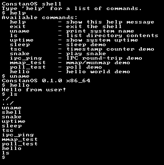

# 🦀 ConstanOS — Rust Operating System Kernel

Un kernel de sistema operativo x86_64 escrito en Rust desde cero, con multitarea preemptiva, aislamiento de memoria por proceso, un VFS propio, IPC, y soporte para binarios C reales vía un puerto propio de [mlibc](https://github.com/managarm/mlibc).



## 📋 Descripción

Empezó como un proyecto de aprendizaje ("SO2") para explorar desarrollo de sistemas operativos en Rust, y creció hasta tener un scheduler preemptivo real, syscalls compatibles con la ABI de Linux, fork con copy-on-write, un loader de ELF, y un port de libc que permite compilar y correr programas en C sin modificaciones (más allá del target).

## 🚀 Qué tiene implementado

- **Boot UEFI** vía el crate `bootloader`, framebuffer + consola serial.
- **Memoria**: buddy allocator físico (bitmap O(1)) + slab allocator para el heap del kernel; paginación por proceso con demand paging y VMAs.
- **Multitarea preemptiva**: scheduler de prioridades multinivel, quantum dinámico, aging anti-starvation.
- **Procesos**: `fork()` con copy-on-write real, `exec()` vía loader de ELF64, `waitpid()`, aislamiento completo de tablas de páginas por proceso.
- **Threads reales**: `clone()` crea un `Process` que comparte el `AddressSpace` (`Arc<AddressSpace>`, sin COW) *y* la `FileDescriptorTable` (`Arc<Mutex<..>>`) del padre en vez de aislarlos — soporta `pthread_create`/`pthread_join`/`pthread_cond_*` de mlibc de punta a punta. Un thread que sale se reap-ea inmediatamente en el kernel (no queda zombie: `pthread_join` de mlibc es 100% futex-based y nunca llama `waitpid()` sobre el tid).
- **Pipes** (`pipe(2)`): IPC anónima con ring buffer, lectura/escritura bloqueante, `EOF`/`EPIPE`, fds heredados por `fork()` (refcount por extremo vía `FileHandle::dup()`).
- **Señales POSIX**: `kill`, `sigaction`, `sigprocmask`, `sigreturn` — `SIGKILL`/`SIGTERM`/`SIGSEGV`/`SIGPIPE`/`SIGUSR1`/`SIGUSR2` (default: terminar) y `SIGCHLD` (default: ignorar). El kernel arma el frame de la señal en la propia pila de usuario y lo redirige a través de una página trampolín mapeada de forma transparente (mlibc no necesita instalar `sa_restorer`). La entrega se engancha en cada retorno a modo usuario: fin de syscall, preempción por timer, y cada wakeup de una syscall bloqueante.
- **Syscalls** con números compatibles con Linux (`read`, `write`, `open`, `mmap`, `fork`, `clone`, `exec`, `futex`, `arch_prctl`, `poll`/`epoll`, `clock_gettime`, `pipe`, `kill`, `sigaction`, `sigprocmask`, `sigreturn`, ...) entradas por la instrucción `syscall` (MSR LSTAR).
- **VFS propio**: initramfs + devfs (`/dev/null`, `/dev/zero`, `/dev/console`, `/dev/fb`, `/dev/kbd`) + ramfs escribible en `/tmp` + **ext2 de solo lectura en `/mnt`**, sobre un driver ATA PIO propio (canal secundario IDE) — el disco (`disk.img`, sembrado con `mke2fs -d`) sobrevive entre corridas de `cargo run`. `stat`/`getdents64`.
- **IPC**: canales tipo socket (`socket`/`bind`/`connect`/`accept`/`sendmsg`/`recvmsg`) con `poll`/`epoll`.
- **Tiempo**: TSC calibrado contra el PIT, hrtimer, `nanosleep`, `clock_gettime`.
- **Consola con framebuffer** con soporte de escapes ANSI (colores, posicionamiento de cursor).
- **mlibc portado a este kernel** (`mlibc-port/`, ver más abajo): permite compilar programas en C reales (`printf`, `malloc`, TLS, stdio con buffering) contra la ABI de syscalls propia.

### Programas de usuario incluidos

Un pequeño shell interactivo (`shell`) hace `fork`+`exec` de estos binarios:

| Programa | Qué hace |
|---|---|
| `shell` | REPL con `help`, y despacho de comandos a los demás binarios |
| `ls` | Lista archivos vía `getdents64` real sobre el VFS |
| `uname` | Info del sistema |
| `uptime` / `sleep` / `tsc` | Demos de tiempo (hrtimer, `nanosleep`, TSC) |
| `snake` | El clásico, dibujado con ANSI sobre `/dev/fb`, input no bloqueante por `/dev/kbd` |
| `ipc_ping` | Demo de IPC: fork + servidor + cliente, 100 round-trips por canal |
| `mmap_test` / `poll_test` | Ejercitan `mmap`/`munmap` y `poll` end-to-end |
| `hello` | Programa en **C real**, compilado y linkeado contra mlibc — `printf("Hello from user!\n")` pasando por todo el stack de stdio de libc |
| `pthread_test` | Programa en **C real**: 3 threads (`pthread_create`) incrementando un contador bajo mutex, `pthread_join`, verifica el resultado — ejercita `clone()` de punta a punta |
| `producer_consumer` | Programa en **C real**: productor/consumidor con `pthread_cond_t` (`pthread_cond_wait`/`broadcast`) sobre un ring buffer — ejercita el path de condvars (dos futex words por hilo) |
| `pipe_test` | `pipe()` + `fork()`: el hijo escribe un mensaje y cierra, el padre lee hasta `EOF` y compara |
| `signal_test` | ABI cruda del kernel: `sigaction(SIGUSR1)`, `fork()`, el hijo hace `kill()` al padre, verifica entrega + retorno vía `sigreturn`, y que `SIGCHLD` llegue al salir el hijo |
| `mlibc_signal_test` | Programa en **C real**: lo mismo que `signal_test` pero pasando por `pipe()`/`fork()`/`kill()`/`sigaction()` reales de mlibc |

## 🏗️ Estructura del workspace

```
.
├── kernel/              # Kernel bare-metal (#![no_std], target x86_64-unknown-none)
│   ├── src/
│   │   ├── memory/       # Buddy/slab allocators, paginación, ELF loader, demand paging
│   │   ├── process/      # Scheduler, syscalls, fork/exec, trapframes
│   │   ├── fs/           # VFS: initramfs, devfs, ramfs, ext2 (RO), tipos compartidos
│   │   ├── ipc/          # Canales tipo socket
│   │   ├── block/        # Driver ATA PIO (canal secundario IDE)
│   │   ├── drivers/      # /dev/null, /dev/zero, /dev/console, /dev/fb, /dev/kbd
│   │   └── time/         # TSC, hrtimer, clocksource
│   └── embedded/         # ELFs de userspace embebidos vía include_bytes!
├── userspace/            # Programas de usuario en Rust (workspace Cargo separado)
├── mlibc/                # Submódulo git: mlibc upstream (managarm/mlibc)
├── mlibc-port/           # Puerto propio de mlibc a este kernel (sysdeps "constanos")
├── scripts/setup-mlibc.sh # Reconstruye el sysroot de mlibc automáticamente
├── disk-image-root/      # Contenido semilla del disco ext2 (/mnt) — mke2fs -d
└── build.rs / src/main.rs # Host: arma la imagen UEFI + disk.img, lanza QEMU
```

## 🚀 Cómo correrlo

Requisitos:
- Toolchain de Rust **nightly** (fijado en `rust-toolchain.toml`, se instala solo con `rustup`).
- `qemu-system-x86_64`.
- `clang`, `llvm` (para `llvm-ar`/`llvm-strip`/`llvm-objcopy`), `meson`, `ninja` — para compilar el sysroot de mlibc la primera vez.
- `e2fsprogs` (`mke2fs`) — para armar `disk.img` (el ext2 que se monta en `/mnt`) la primera vez. Opcional: sin esto el build sigue, simplemente no hay `/mnt`.

En Arch:
```bash
sudo pacman -S qemu-system-x86 qemu-img qemu-ui-gtk edk2-ovmf clang llvm meson ninja lld e2fsprogs
```

Y listo:
```bash
cargo run
```

Este comando, desde un clon limpio, hace **todo** solo: inicializa el submódulo `mlibc/`, arma su sysroot (`sysroot/`), compila los programas de `userspace/` y el `hello.c`, compila el kernel, arma la imagen UEFI, y levanta QEMU (con ventana gráfica si tenés `qemu-ui-gtk`, si no cae a VNC).

## 🎯 Estado / por implementar

Lo que falta o está a medias, mirando el propio código:

- ⏳ **Sin linker dinámico**: `exec()` solo carga binarios estáticos, no hay `.so`/relocations.
- ⏳ **Un solo core real**: la infraestructura para SMP existe (arrays por-CPU, `MAX_CPUS=8`) pero `cpu_id()` siempre devuelve 0.
- ⏳ **ext2 sin escritura**: `/mnt` lee de un disco real (ATA PIO), pero no hay allocation de bloques/inodos ni bitmaps — crear/escribir archivos ahí todavía no anda. `/tmp` (ramfs) sigue siendo lo único escribible, pero no persiste entre reboots.
- ✅ **Leak de stack por hilo, arreglado en su mayor parte**: el `mmap()` de 2MiB que mlibc arma para la pila de cada `pthread_create` nunca se liberaba — es un gap de mlibc *upstream* (`pthread_exit`/`thread_join` tienen TODOs/FIXMEs propios admitiéndolo), no específico de este puerto. El kernel ahora lo libera solo al morir el hilo (mismo patrón de liberación diferida que `kernel_stack`, evitando el mismo peligro de liberar la pila mientras el hilo todavía corre sobre ella). Con `meminfo`: bajó de ~8.9MB a ~2.7MB perdidos por corrida de `pthread_test` — probablemente el TCB en sí (`thread_join`'s FIXME: "destroy tcb here, currently we leak it"), sin investigar todavía.

---

*Proyecto de aprendizaje personal para explorar el desarrollo de sistemas operativos en Rust — con bastante ayuda de Claude Code en el camino.*
