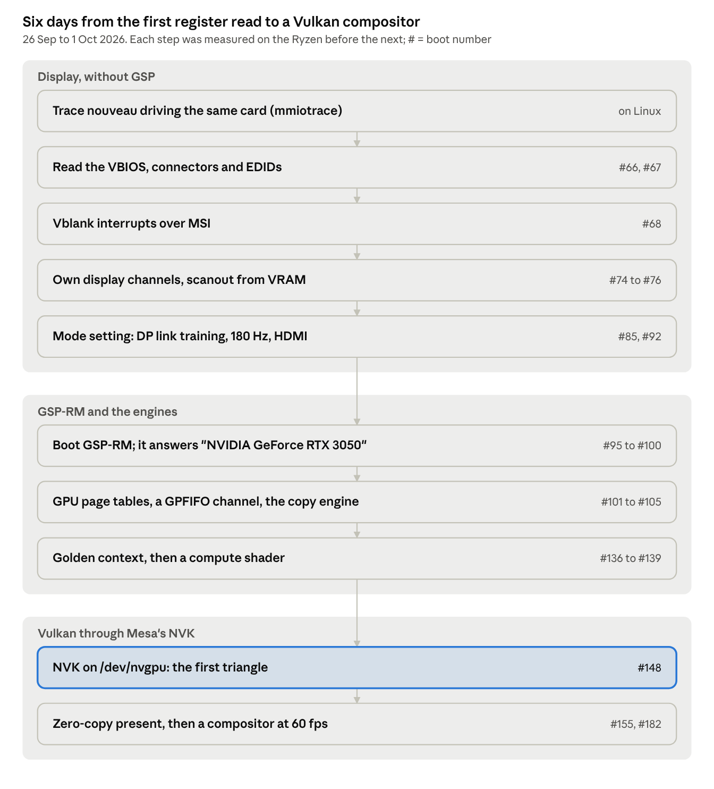

# Driving an NVIDIA GPU from a hobby Rust kernel: GSP-RM to Vulkan

*Jairo Alarcón · October 2026*

My hobby kernel, constanos, now drives an NVIDIA RTX 3050 on its own: it boots NVIDIA's GSP-RM firmware, sets display modes, runs GPFIFO channels, and hosts a port of Mesa's NVK, so unmodified Vulkan code draws on the GPU and a compositor shows it at 60 fps. There is no Linux underneath, and no NVIDIA kernel module: the driver is about 31,000 lines of Rust, written from scratch in Chile by one person working with an AI agent.

This post is the story of that driver: the ladder from "read one register" to "a Vulkan triangle on the monitor", the bugs that cost the most, and how you test a GPU driver on a machine with no serial port.

## The setup

[constanos](https://github.com/oriaj-nocrala/rust_so_kernel) is an x86-64 kernel in Rust: `no_std`, UEFI, SMP, with a Linux-numbered syscall ABI. Userland is [mlibc](https://github.com/managarm/mlibc) plus unmodified BusyBox, and static musl binaries (Rust std and tokio included) run as they are. It runs in QEMU and on one real machine: a Ryzen 9 5900X with an RTX 3050 (GA106, PCI id `10de:2507`).

That machine has no serial port, no PS/2 and no IDE. Keyboard, mouse and disk all come in over USB, through a USB stack of my own. The kernel log goes to a raw partition on the boot stick, and I read it from Linux after the reboot.

The GPU work started with a small wish. The desktop drew into the firmware's GOP framebuffer: no vsync, no idea which monitor was attached, stuck at 60 Hz on a 180 Hz panel. I wanted the monitors' names, a vblank interrupt, and 180 Hz. Then the goal kept moving.

## The ladder

The driver was built one rung at a time, and no rung started before the previous one had passed a measured check on the real machine.

The display came first, without GSP-RM: nouveau's own trace showed that its GSP path could not drive this display, so mode setting is my own code. GSP-RM came after, for what only it can do on this chip: running work on the engines.

## Four bugs worth the reboot count

Every boot on the Ryzen is numbered. The GPU work runs from boot #66 to past #200, and a handful of bugs ate most of them.

**GSP-RM quietly kills BAR1.** BAR1 is the window the CPU uses to reach VRAM; the firmware sets it up as "VRAM from offset 0". When GSP-RM boots, it rewrites `NV_PBUS_BAR1_BLOCK` (`0x1704`) to a block of its own, and from then on CPU writes through BAR1 land nowhere and reads return `0xbad0ac..`. Nothing crashed. What gave it away was a CPU-versus-copy-engine benchmark: its first CPU numbers (boots #110 to #117) compared against data the copy engine had already left in place, so they "passed" while measuring nothing. The fix is one function, `gsp::restore_bar1`, which writes the firmware's value back after GSP-RM is up; without it, the compositor would have been flushing frames into a dead window. The bigger lesson: a check that can pass on stale data proves nothing, so checks now scramble the destination first and read it back by a different path.

**A page directory with its halves swapped.** The first copy-engine runs (boots #102 to #104) turned up a bug each: the doorbell register, then the runlist token. The third one, and the one underneath everything, was in my MMU code: the PD0 "dual PDE" entry, which holds a pointer to a big-page table and one to a small-page table, had the two halves in the wrong order. I found it in NVIDIA's own hardware manuals ([open-gpu-doc](https://github.com/NVIDIA/open-gpu-doc), `dev_mmu.ref.txt`), not in a driver. Boot #105 copied 4 MiB each way, byte for byte, at 6.1 and 6.4 GB/s, the ceiling of that PCIe x8 link.

**Error 31, nine boots in a row.** To run compute or 3D, GSP-RM must build a "golden" context for the graphics engine. Its `PROMOTE_CTX` call returned 31 with no message, every time the main buffer carried a virtual address. My RPC bytes matched nouveau's. What did not match was the memory around the call: the channel has to live in an address space that RM manages but whose page directory is mine, with the buffers already mapped. Boot #136 passed. When firmware says no without saying why, compare the whole state it can see, not only the message you sent.

**The mouse moved one pixel and the GPU channel died.** The compositor's fragment shader read window pixels from a buffer, indexed by the fragment's screen position. GPUs shade in 2x2 quads, and at a rectangle starting on an odd pixel the extra "helper" lanes computed index -1. As an unsigned number that is 16 GiB past the buffer, an unmapped address: an MMU fault (Xid 31) and a dead channel. It only happened when the pointer landed on an odd column. Desktop GPUs with robust buffer access hide this bug, so my host-side pixel tests could not catch it; the fix was a `clamp` into the rectangle.

## Porting NVK instead of writing a Vulkan driver

Writing a Vulkan driver was never the plan. Mesa's NVK already knows how to build command buffers for Ampere, and its shader compiler, NAK, already emits SM86 code. What NVK needs from below is small and well defined: Mesa has an internal interface, `nvkmd`, and the nouveau backend behind it is about 1,500 lines. So constanos got its own backend, `nvkmd_constanos` (about 1,300 lines of C), talking to a device of its own, `/dev/nvgpu`.

`/dev/nvgpu` has 24 ioctls: allocate and map buffers, create contexts, submit pushes, wait on fences, export and import buffers between processes, and present a buffer on the screen. One rule shaped it: the kernel never blocks inside an ioctl. A submit or a wait that cannot finish yet returns `EAGAIN`, and user space sleeps on `poll`.

The interface came first as a software model running in QEMU, with no GPU behind it. NVK ran all of its setup against that model, and the hardware backend was then slotted in behind the same interface. The software model was committed at 12:26 on 30 September; at 15:13 the same day, the first triangle came out of the real GPU: 64x64 pixels, all 4,096 checked by the CPU.

The whole 3D stack (NVK, NAK, which is Rust, and Mesa's C) is linked statically against musl, not mlibc, so a Vulkan program is a single static binary. Presentation needed one more piece: Mesa's "headless" surface becomes the real screen when the device has a display, and windowed programs hand their surface to the compositor over a Unix socket. The compositor itself, `vk_comp`, is just another Vulkan client.

*A frame from `vk_comp`'s renderer: rounded boxes, shadows and a compute-shader blur behind the glass. This one was rendered on the host (lavapipe) by the test harness that compares it pixel by pixel with a CPU rasterizer; on the Ryzen, the same renderer runs on the RTX 3050.*

## Testing a GPU driver with no serial port

A GPU bug on this machine usually looks like a black screen and a reboot. Three habits kept that rare.

**An oracle from the same machine.** The Ryzen dual-boots Linux. Before writing any GPU code, I traced nouveau driving this exact card with mmiotrace: 2.3 million register writes without GSP and 1,332 GSP-RM RPCs with it, plus the VBIOS and EDIDs. Every constant in the driver cites the nouveau line or the NVIDIA manual it comes from, and segments of the trace became test fixtures.

**Pure logic, replayed on the host.** The driver is split in two. The crate `nvgpu` holds the logic (page tables, push buffers, RPC encoding, display methods) and talks to the hardware only through a trait, so `cargo test` can replay a recorded trace against it. That is 455 tests on the host. A test only counts once it fails when the code it covers is sabotaged, and scripted mutations check that for the risky parts. The kernel side, `kernel/src/gpu/`, is a thin adapter.

**Unattended runs on the real machine.** A script puts a job on the USB stick, sets the boot options, and reboots into constanos once. A watchdog reboots the machine if the kernel hangs, the log lands in its partition, and the verdict is read back from Linux. Each step of the ladder had a criterion measured this way before the next one started; the screen itself was checked by eye, and sometimes with a phone photo.

## Built with an AI agent

Most of the code was written by Claude Code, and the commits say so. The GPU commits span six days, 26 September to 1 October 2026: first register read to a Vulkan compositor. That pace is not possible for one person typing alone.

The six days are mostly waiting: the git history has commits in about 50 distinct hours, and none at all on 28 September. The limit was my Claude usage quota, not the work.

The division of labour was roughly this. I chose where to go next and what "done" meant, ran every boot on the real machine (it reboots my own PC, so I have to be there), and looked at the screen. The agent read nouveau, NVIDIA's manuals and the traces, wrote the driver and its tests, and wrote down what each boot showed.

The agent was confidently wrong more than once: a firmware signature taken from the wrong function, benchmark numbers that measured stale data, a nouveau formula copied faithfully even though it is wrong for this chip. What caught those was never a second opinion. It was the machine: a measured criterion per step, sabotage-proven tests, and an oracle trace from the same card.

## What's next

The biggest gap is isolation: every `/dev/nvgpu` session shares one set of GPU page tables, so one process's shader could read another's memory. After that come a hardware cursor (it works on one display head and not yet on the other), direct scanout for fullscreen windows, and explicit sync.

The code is MIT or Apache-2.0:

- Repository: [github.com/oriaj-nocrala/rust_so_kernel](https://github.com/oriaj-nocrala/rust_so_kernel)
- The driver's current state: [docs/reference/gpu.md](../reference/gpu.md)
- The step-by-step plan with every boot's result (in Spanish): [docs/gpu/gpu-plan.md](../gpu/gpu-plan.md)
- The Mesa side: [mesa-port/](../../mesa-port/)
